

10-second tour: Universe → Tier 0 → Tier 1 → Tier 2 → Ensemble → Decide

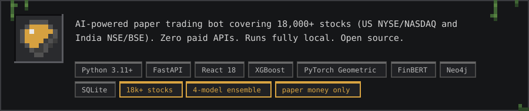



<h2></h2>

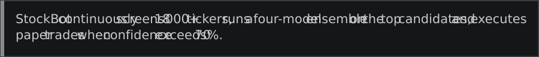

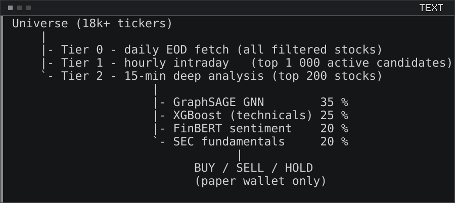

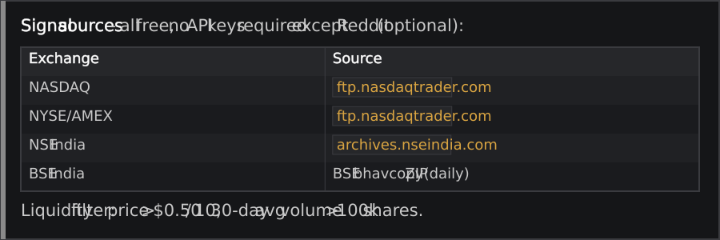

<h2>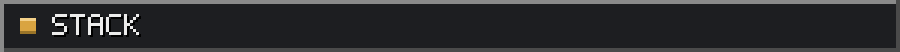</h2>

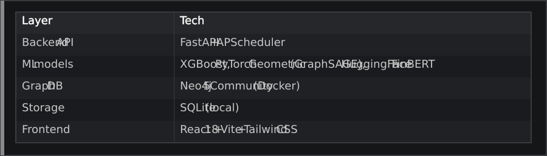

<h2>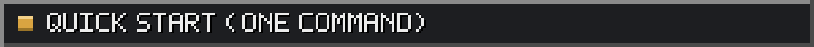</h2>

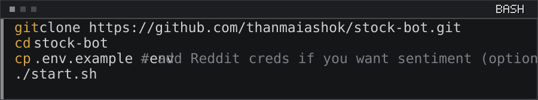

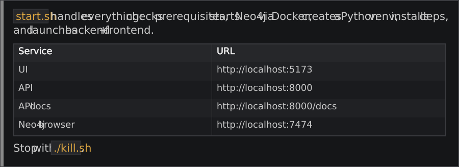

<h3></h3>

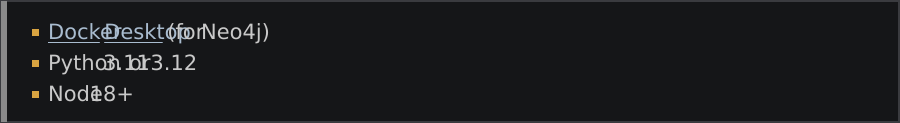

<a href="https://www.docker.com/products/docker-desktop/">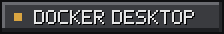</a>

<h2>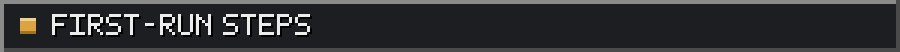</h2>

<h3>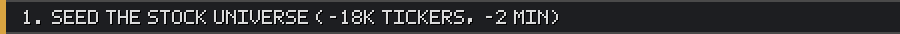</h3>

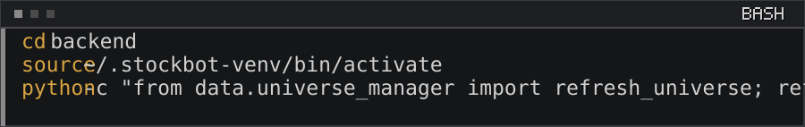

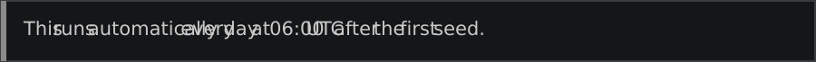

<h3>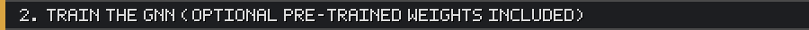</h3>

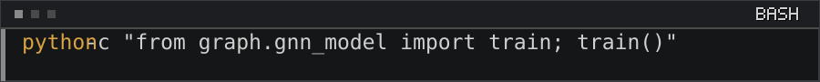

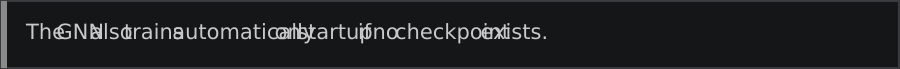

<h2>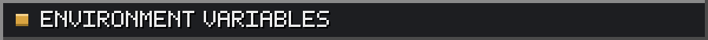</h2>

<h2>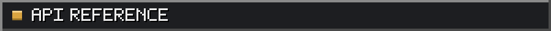</h2>

<h2>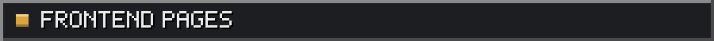</h2>

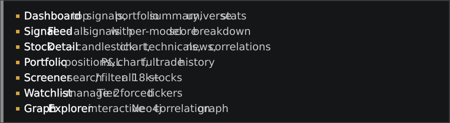

<h2>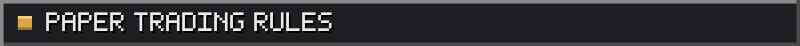</h2>

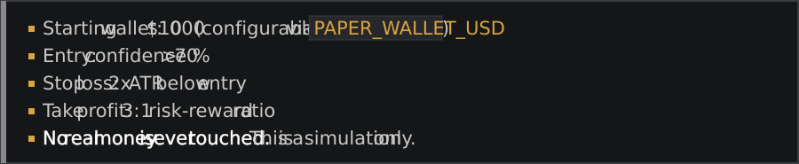

<h2>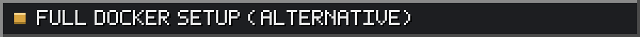</h2>

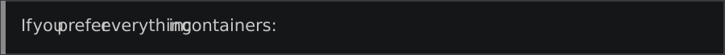

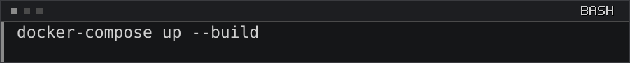

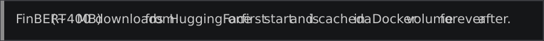

<h2>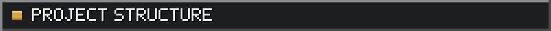</h2>

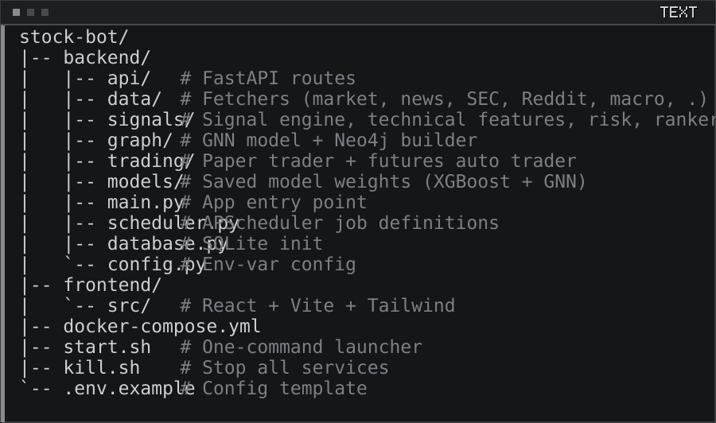

<h2></h2>

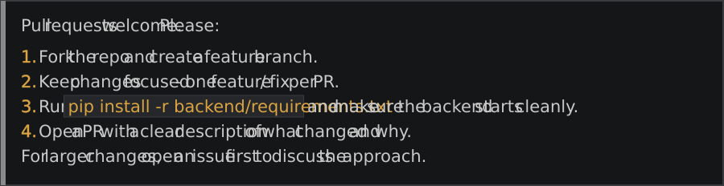

<h2></h2>

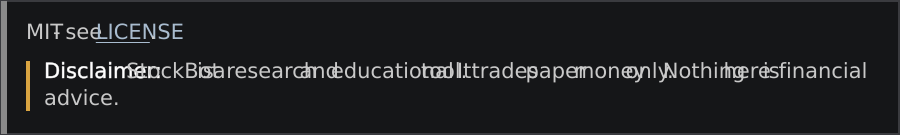

